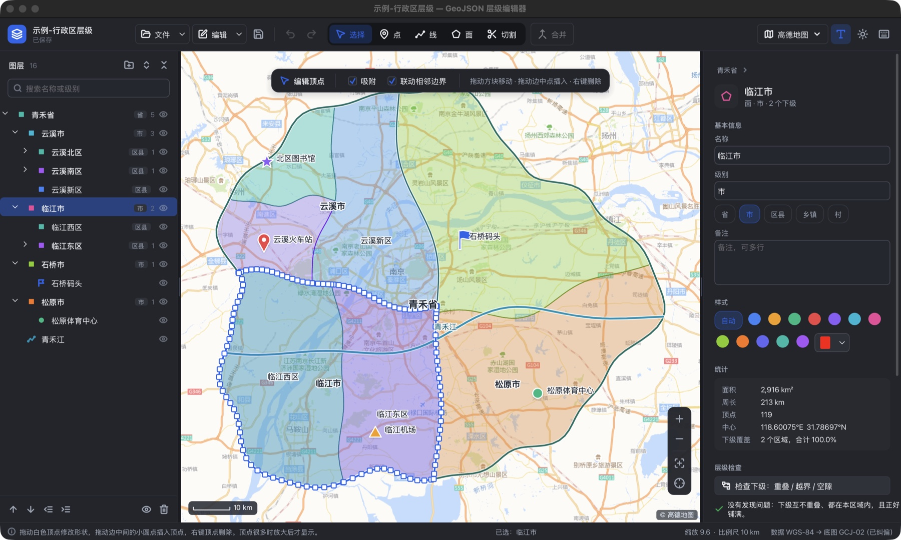
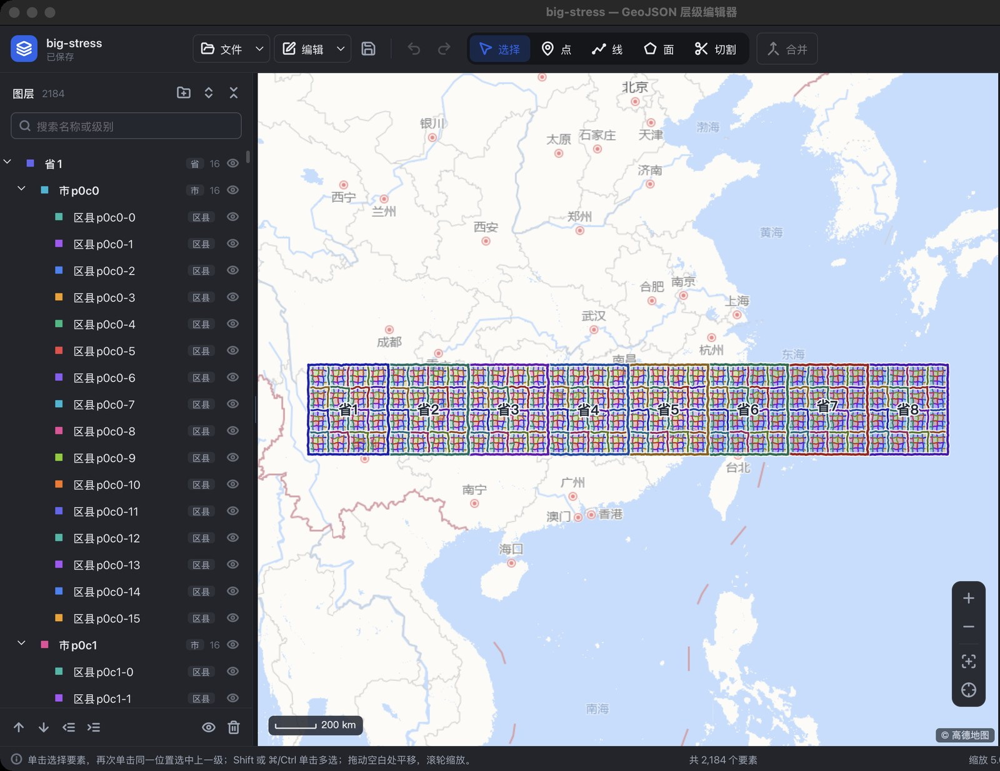

# GeoJSON 层级编辑器

桌面端的 GeoJSON 编辑器，专门处理有上下级关系的区域数据（省 → 市 → 区县）。父子关系体现在几何上：切割、合并、编辑顶点、简化边界时，相邻区域之间、上下级之间的边界始终保持一致。支持点标记、在线底图、多窗口之间复制粘贴要素，上百万顶点的数据也能流畅浏览。Windows 和 macOS 都能用。

A desktop editor for hierarchical GeoJSON (province → city → district). Split, merge, reshape and simplify boundaries while shared borders and parent/child outlines stay consistent. Copy and paste features between windows, point markers, online basemaps, level-of-detail rendering for million-vertex datasets. Built with [MewUI](https://github.com/aprillz/MewUI), SkiaSharp and NetTopologySuite; runs on Windows x64 and macOS (Apple Silicon).



## 下载

到 [Releases](../../releases) 下载最新版本：

- **Windows x64**：`GeoJsonEditor-<版本>-win-x64.zip`。解压后双击 `GeoJsonEditor.exe`，自带 .NET 运行时，不用另装。程序没有代码签名，第一次运行如果出现“Windows 已保护你的电脑”，点“更多信息 → 仍要运行”。
- **macOS（Apple Silicon）**：`GeoJsonEditor-<版本>-macos-arm64.zip`，解压得到 `GeoJSON 层级编辑器.app`。程序没有经过苹果公证，第一次打开会被拦下，到“系统设置 → 隐私与安全性”里点“仍要打开”；或者在终端执行：

```bash
xattr -dr com.apple.quarantine "GeoJSON 层级编辑器.app"
```

首次启动会打开内置的示例数据：一个虚构的省，下面有 4 个市、5 个区县、5 个点标记和一条河。

## 功能

| 功能 | 操作 |
|---|---|
| 选择 | 选择工具（V）下单击。再次单击同一位置选中上一级；Shift 或 ⌘/Ctrl 单击多选；拖动空白处平移，滚轮缩放 |
| 画点 / 线 / 面 | P / L / A。单击加点，双击、回车或右键完成，退格撤回一点，Esc 取消。靠近已有顶点和边时自动吸附 |
| 新要素挂到哪里 | 选中面或分组后再选绘制工具，新要素成为它的下级；地图上方的工具条里可以改“添加到” |
| 画面时自动整理 | “裁剪到上级”去掉超出上级的部分，“避让同级”扣掉与已有同级区域重叠的部分，相邻区域正好共用边界 |
| 切割 | X，画一条完整穿过区域的线，双击执行，画线时实时预览切出的各块。**替换原区域**：下级跟着切开，按位置分到各块；**划分为下级**：原区域保留，切出的块成为它的下级，用来逐级细分 |
| 合并 | 多选几个面（或几条线）后按 M。第一个选中的保留名称和属性，其余的下级都挂到合并结果下 |
| 顶点编辑 | 选中一个面或线：拖动白色方块移动顶点，拖动边中点插入顶点，右键或双击顶点删除。“联动相邻边界”打开时，相邻区域和上级的同一个顶点一起移动。顶点很密的边界放大后才显示手柄，只处理视野内的顶点，几十万顶点的边界也能局部编辑 |
| 复制粘贴 | ⌘/Ctrl+C、X、V。要素连同全部下级、属性和样式一起复制，可以粘贴到另一个窗口、另一个程序实例，也能粘贴到 geojson.io、QGIS 这类软件里。反过来，其他软件复制的 GeoJSON、WKT 或“经度, 纬度”文本也能直接粘贴进来。两边的数据坐标系不同时自动纠偏。选中面或分组时粘贴为它的下级 |
| 创建副本、全选同级 | ⌘/Ctrl+D 在原位置创建副本（连同下级）；⌘/Ctrl+A 选中与当前要素同一上级的全部要素 |
| 多窗口 | 文件 → 新建窗口（⌘/Ctrl+Shift+N）、在新窗口中打开，同时编辑几张地图，窗口之间复制粘贴 |
| 简化边界 | 编辑菜单、右键菜单或属性面板。按允许偏差（1 m 到 1 km）去掉对形状影响很小的顶点，相邻区域的公共边界、上下级重合的边界一起简化，简化后仍然严丝合缝。先预览顶点数的变化，确认后作为一步撤销应用 |
| 点标记 | 名称、级别、备注、颜色、图标（图钉、圆点、星形、方块、三角、旗帜）。选中后可直接拖动 |
| 层级 | 图层树里拖动节点到另一节点上即成为它的下级，拖到空白处移到根级；底部按钮上移、下移、升一级、降一级 |
| 层级检查 | 属性面板“层级检查”：找出下级之间的重叠、超出上级的部分、上级里没被下级覆盖的空隙，在地图上标红，并给出修复按钮 |
| 由下级生成边界 / 裁剪到上级 | 属性面板或右键菜单 |
| 属性 | 名称、级别（常用级别一键选择）、备注、颜色；其他属性可改值、删除、新增 |
| 统计 | 面积、周长、长度、顶点数、中心坐标、下级覆盖比例（按球面计算） |
| 文件 | 新建、打开、导入到所选节点下、保存、另存为、导出所选（含下级）；把 .geojson 拖进窗口即可打开或导入。大文件在后台读取，界面不卡 |
| 撤销 / 重做 | ⌘/Ctrl+Z、⌘/Ctrl+Shift+Z |

完整快捷键见右上角的键盘按钮。

## 大数据



- **分级简化显示**：每条边界预先算好每个顶点的 Douglas–Peucker 显著度，按当前缩放级别只取需要的顶点，屏幕上的误差不超过 0.25 像素。缩小到全国范围时，161 万个顶点只需画几千个。
- **图层缓存**：数据量大时，面和线先画到一张比视野大一圈的离屏图像上，平移时直接挪动图像；滚轮缩放过程中先把图像按比例缩放顶替，停下后再重画清晰的版本。
- **后台读取**：2 MB 以上的文件在后台线程读取，同时并行完成投影和简化准备，读取时显示进度遮罩。
- **其他**：命中测试、吸附、切割预览都只查视野内的要素，大边界按分块包围盒只检查鼠标附近的顶点；切割预览在后台线程计算；标注按网格做碰撞检测，每帧计算新标注的时间有上限；点标记很多时改画小圆点；撤销快照复用没有变化的要素，历史步数随文档大小自动收缩。

在一台 Apple Silicon 的 Mac 上，用离屏 CPU 画布（2880×1800 像素）绘制一帧面图层的耗时。测试数据是 2,184 个面、161 万个顶点，程序里实际走 GPU，会更快：

| 缩放级别 | 分级简化 | 不简化 |
|---|---|---|
| 5（全国） | 13 ms | 447 ms |
| 6.5 | 54 ms | 366 ms |
| 8 | 52 ms | 154 ms |
| 10 | 19 ms | 24 ms |

同一份数据（38 MB）读取约 0.5 秒，投影和简化准备约 0.06 秒；按 200 m 简化边界，约 29 万顶点的数据用时约 0.1 秒。

## 文件格式

保存为标准 GeoJSON `FeatureCollection`，每个要素一行，上级在前。层级写在 `properties` 里：

```json
{"type":"Feature","id":"c1","properties":{"id":"c1","parentId":"p1","name":"云溪市","level":"市","color":"#3B82F6"},"geometry":{...}}
```

- `geometry` 为 `null` 的是分组。点标记另有 `icon`（`pin`、`circle`、`star`、`square`、`triangle`、`flag`），隐藏的要素写 `hidden: true`。
- 其他属性原样保留、原样写回（数字的写法也不变）。
- 读取时兼容阿里云 DataV 行政区数据：没有 `parentId` 时用 `adcode` 和 `parent.adcode` 还原层级，`level` 的 province/city/district 转成 省/市/区县。也认 geojson.io 的 `fill`、`stroke`、`marker-color` 颜色。
- 写出时外环逆时针、内环顺时针（RFC 7946），坐标保留 7 位小数。
- 复制到剪贴板的内容也是 GeoJSON，只是在 `FeatureCollection` 上多一个 `geojsonEditor` 字段，记录坐标系和来源文档。

## 底图与坐标系

底图可选高德地图、高德影像、Esri 浅灰 / 深灰画布、Esri 影像、OpenStreetMap，或者不用底图；可以调淡化程度、切换灰度。高德是 GCJ-02 坐标，其余是 WGS-84。数据坐标系在属性面板的概况里设置，和底图不一致时显示时自动纠偏，文件里的坐标不会被改动。

瓦片缓存在本机：macOS 在 `~/Library/Application Support/GeoJsonEditor/tiles`，Windows 在 `%LOCALAPPDATA%\GeoJsonEditor\tiles`，看过的区域离线也能显示。

## 从源码构建

需要 [.NET 10 SDK](https://dotnet.microsoft.com/download)。

```bash
dotnet run
```

打包（产物在 `dist/`）：

```bash
scripts/publish.sh win    # Windows x64 单文件 exe 和 zip
scripts/publish.sh mac    # macOS .app 和 zip
scripts/publish.sh        # 两个都打
```

在 macOS 上也能打 Windows 包。核心逻辑的测试（不启动界面）：

```bash
dotnet run --project tests/LogicTests
```

`vendor/packages` 里有一个打过补丁的 `Aprillz.MewUI.Platform.Win32`：MewUI 0.21.1 在 Windows 上关闭 Tooltip 时会误释放鼠标捕获，导致工具栏按钮要点两次才生效（上游问题 [#253](https://github.com/aprillz/MewUI/issues/253)）。这个包是在 v0.21.1 源码上应用上游修复提交 [ce00cdc](https://github.com/aprillz/MewUI/commit/ce00cdccd9) 后重新编译的，程序集版本不变，其他 MewUI 包仍用 NuGet 上的 0.21.1。重新生成的方法见 `scripts/build-mewui-patch.sh`；上游发布包含这个修复的版本后就可以去掉。

## 代码结构

```
src/
  Program.cs              按平台注册 MewUI 平台、渲染后端和 Skia 互操作
  App/Editor.cs           编辑器状态与全部编辑操作（绘制、合并、切割、剪贴板、层级、属性、层级检查、简化）
  Model/                  层级节点；文档（树、选择集、快照式撤销重做）
  IO/GeoJsonIO.cs         带层级的 GeoJSON 读写（流式）
  IO/GeoClipboard.cs      剪贴板格式：GeoJSON / WKT / 经纬度文本的识别与坐标系转换
  Geo/                    投影与纠偏、球面量算、合并切割裁剪、顶点编辑、保持拓扑的边界简化
  Map/                    瓦片、视口、投影缓存与分级简化、Skia 地图画布（绘制、图层缓存、交互）
  Ui/                     主窗口、图层树、属性面板、简化对话框、样式、图标、中文化
tests/LogicTests/         核心逻辑测试、大数据生成与绘制耗时测试
scripts/                  打包脚本、MewUI 补丁包生成脚本
vendor/                   打过补丁的 MewUI Win32 平台包
samples/                  示例数据
```

## 已知限制

- Windows 包是在 macOS 上交叉打包的。
- 程序没有代码签名，macOS 版也没有经过公证，首次运行需要按上面的方法放行。
- 地图缩放只支持滚轮和按钮，不支持触控板捏合手势。
- 剪贴板只交换文本（GeoJSON），不带其他格式。

## 第三方组件

发布包里包含的第三方组件及其许可声明见 [THIRD-PARTY-NOTICES.md](THIRD-PARTY-NOTICES.md)。
